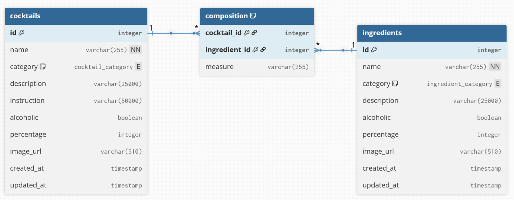
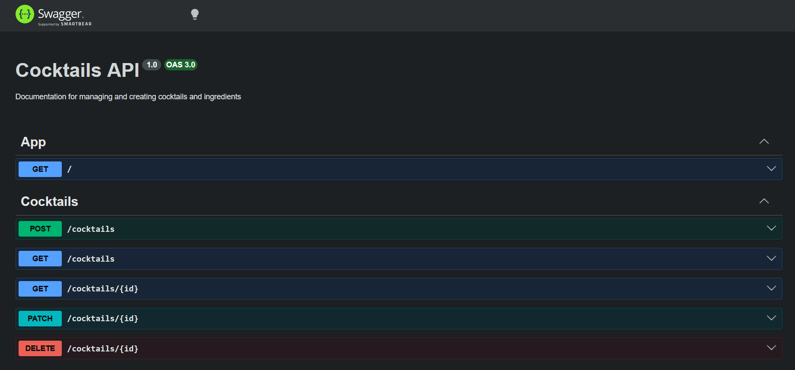

# 🍹 Cocktail API

Cocktail API is an application designed for managing a database of cocktail recipes and ingredients. It is a fully functional REST API that handles CRUD operations while offering a variety of useful filtering and sorting options for both recipes and ingredients.

## 🛠 Tech Stack

The project is built using modern Node.js ecosystem technologies:
* **Framework:** NestJS
* **ORM:** TypeORM
* **Database:** PostgreSQL
* **Database Environment:** Docker (PostgreSQL)
* **Documentation:** Swagger

<p align="center">
    <a href="https://skillicons.dev">
        
    </a>
</p>

## Database Architecture

The relational database was built based on a carefully designed schema and is hosted in a PostgreSQL Docker container. 



Database tables were modeled using TypeORM in NestJS. The application supports full CRUD operations, pagination, sorting by specific attributes, and advanced filtering capabilities. 

##  Getting Started

Follow these steps to get the project up and running on your local machine.

**1. Install dependencies**
```bash
npm install
```

**2. Start the database container**
```bash
docker compose up -d
```

**3. Run the application (Development Mode)**
```bash
npm run start:dev
```

## Database Seeder

The application includes a built-in seeder that populates the database with initial data: 15 cocktails and 30 ingredients. 

> **⚠️ Important:** The seeder will only work on a completely new, clean database. 

To run the seeder, execute:
```bash
npm run seed
```

**Resetting the Database:**
To clear the database and remove any traces of previous records, you must remove the container along with its volumes using the `-v` flag. 
Run the following commands:
```bash
docker compose down -v
docker compose up -d
```

## 📖 API Documentation (Swagger)

The interactive API documentation is generated using Swagger. Once the application is running, it is available at:

`http://localhost:3000/api`

Swagger clearly displays and describes all the requests and endpoints supported by the API.



## 🧪 Testing

Unit and integration tests will be added to the project soon.